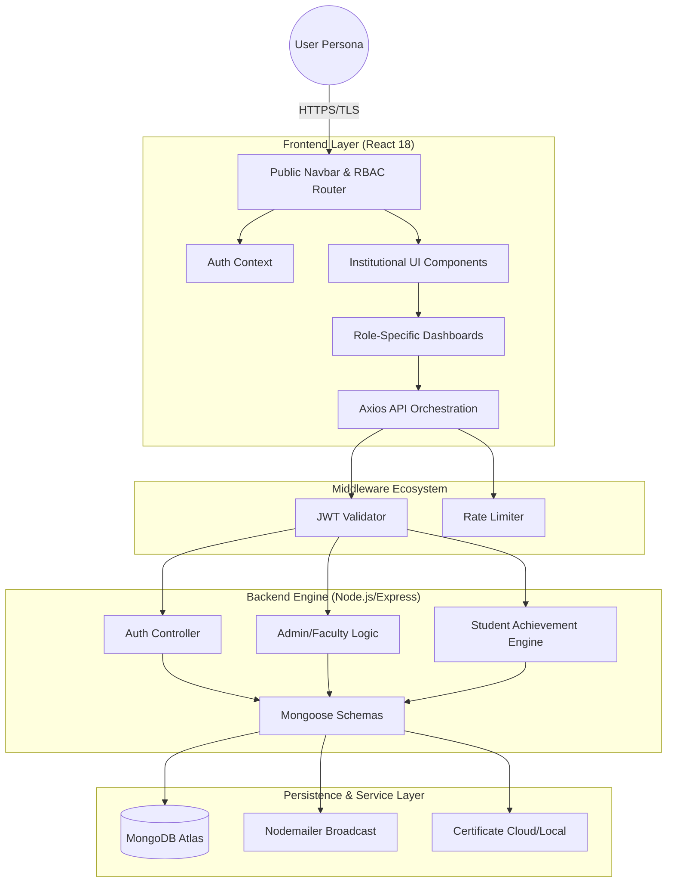
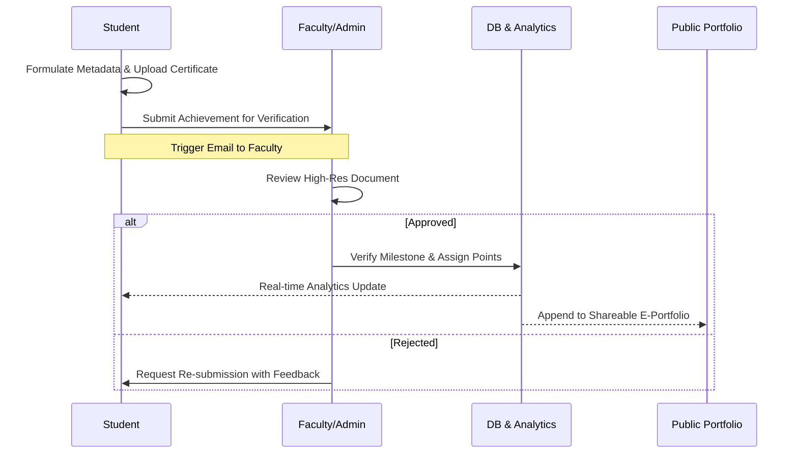

# 🎓 SOEIT Strategic Achievement & Analytics Portal
### *Unified Institutional Excellence Ecosystem for Arka Jain University*

[](https://nodejs.org/)
[](https://vitejs.dev/)
[](https://reactjs.org/)
[](https://www.mongodb.com/)

---

## 🏛️ Phase 1: Institutional Vision
The **SOEIT Achievement Portal** is a high-performance, enterprise-grade digital infrastructure developed for the **School of Engineering & IT (SOEIT)**. It serves as the single source of truth for student milestones, faculty oversight, and institutional auditing. Designed with a **Premium Academic Aesthetic**, the platform eliminates administrative friction and replaces legacy tracking with a seamless, data-driven ecosystem.

> [!IMPORTANT]
> **Audit-Ready Infrastructure**: Every transaction and verification cycle is logged for NAAC, NIRF, and internal institutional compliance reporting.

---

## 🏗️ Phase 2: Architectural Blueprint

### 🧩 High-Level System Architecture
The portal utilizes a decoupled **MERN-V** stack (MongoDB, Express, React, Node, Vite) optimized for high-concurrency certificate processing.



---

## 🔄 Phase 3: Operational Flow (Achievement Lifecycle)

This diagram illustrates the standard operating procedure for a student achievement from initial submission to public portfolio deployment.



---

## 👥 Phase 4: User Personas & Permissions (RBAC)

| Role | Access Level | Primary Responsibility |
| :-- | :-- | :-- |
| **Student** | Learner | Achievement submission, Portfolio management, Progress tracking |
| **Faculty** | Overseer | Dept-wide monitoring, Notice broadcasting, Student analytics |
| **Admin** | Validator | Secondary verification, Event management, Institutional reporting |
| **Super Admin** | Controller | Global system configuration, User management, Security audits |

---

## 🛠️ Phase 5: Technical Implementation Detail

### 💎 Frontend Strategy
- **Design Language**: Bespoke **Vanilla CSS tokens** ensuring zero-dependency UI stability.
- **Cinematic Experience**: Integrated **AOS (Animate On Scroll)** for institutional gravity.
- **Performance**: Vite-powered **Code Splitting** and Lazy Loading for sub-second TTI (Time To Interactive).

### 🛡️ Backend & Security Protocols
- **Stateful Auth**: JWT-encrypted sessions with auto-refresh and secure cookie rotation.
- **Data Hygiene**: Strict **Sanitized Input Layer** with validation middleware to prevent XSS and SQLi.
- **Reporting Engine**: Advanced MongoDB **Aggregation Pipelines** for real-time statistical generation.

---

## 📂 Phase 6: Project Ecosystem

```text
SOEIT-Portal/
├── frontend/                   # Client Interface (React 18 Engine)
│   ├── src/
│   │   ├── components/         # Atomic UI Components (Nav, Modals, Loaders)
│   │   ├── pages/              # Domain-specific views (Public, Auth, Admin)
│   │   ├── services/           # Axios-powered API Orchestration Layer
│   │   └── context/            # Enterprise State Management (Auth, Context)
│   └── public/                 # Optimized Brand Assets
│
└── backend/                    # Core API (Server-side Logic)
    ├── controllers/            # Business Logic Orchestration
    ├── models/                 # Mongoose Data Definitions
    ├── routes/                 # Protected API Endpoints
    ├── middleware/             # Auth Guards & Security Pipelines
    └── config/                 # Environment & Database Connectors
```

---

## 🚀 Phase 7: Deployment Orchestration

### 🔹 1. Configuration (`.env`)
```env
# Core API Security
PORT=5000
MONGODB_URI=institutional_db_uri
JWT_SECRET=high_entropy_secret_key

# Institutional Mail Service
SMTP_USER=official_soeit_broadcast
SMTP_PASS=managed_app_credential
```

### 🔹 2. System Initialization
```bash
# Unified Dependency Resolution
npm run install-all

# Execution (Development Mode)
npm run start-dev
```

---

## 📈 Phase 8: Strategic Roadmap
- [ ] **AI-driven Validation**: Automated certificate parsing and fraud detection via OCR.
- [ ] **Alumni Integration**: Extending achievement lifecycles to SOEIT post-graduates.
- [ ] **Institutional Dashboard**: High-level dean's view for department-wide comparisons.

---

**Designed & Engineered for the School of Engineering & IT**
*Arka Jain University — Pioneering Technical Education & Student Success*


