# SOEIT Achievement Portal - UML Use Case Diagram

## Overview
This document contains the UML Use Case Diagram for the SOEIT Achievement Portal system.

## Mermaid Diagram Code

Copy the code below and paste it into:
- [Mermaid Live Editor](https://mermaid.live)
- VS Code with Mermaid extension
- Any markdown renderer that supports Mermaid

```mermaid
graph TB
    subgraph Actors
        Student["👤 Student"]
        Faculty["👨‍🏫 Faculty/Advisor"]
        Admin["🔐 Admin"]
    end

    subgraph Authentication["Authentication System"]
        Register["Register Account"]
        Login["Login"]
        Logout["Logout"]
        ResetPassword["Reset Password"]
        ForgotPassword["Forgot Password"]
    end

    subgraph UserMgmt["User Management"]
        ViewProfile["View Profile"]
        EditProfile["Edit Profile"]
        ViewUser["View User Profile"]
        ManageUsers["Manage Users"]
        DeactivateUser["Deactivate User"]
    end

    subgraph AchievementMgmt["Achievement Management"]
        SubmitAchievement["Submit Achievement"]
        ViewAchievements["View Achievements"]
        VerifyAchievement["Verify Achievement"]
        RejectAchievement["Reject Achievement"]
        ManageAchievements["Manage Achievements"]
        ExportAchievements["Export Certificate/Resume"]
    end

    subgraph CourseMgmt["Course Management"]
        ViewCourses["View Courses"]
        EnrollCourse["Enroll in Course"]
        ViewAssignments["View Assignments"]
        SubmitAssignment["Submit Assignment"]
        GradeAssignment["Grade Assignment"]
        ManageCourses["Manage Courses"]
    end

    subgraph EventMgmt["Event Management"]
        CreateEvent["Create Event"]
        ViewEvents["View Events"]
        RegisterEvent["Register for Event"]
        ParticipateEvent["Participate in Event"]
        ManageEvent["Manage Events"]
    end

    subgraph HackathonMgmt["Hackathon Management"]
        ViewHackathons["View Hackathons"]
        RegisterHackathon["Register for Hackathon"]
        SubmitHackEntry["Submit Hackathon Entry"]
        ManageHackathon["Manage Hackathons"]
        EvaluateSubmission["Evaluate Submission"]
    end

    subgraph InternshipMgmt["Internship Management"]
        ViewInternships["View Internship Postings"]
        ApplyInternship["Apply for Internship"]
        PostInternship["Post Internship Offering"]
        ManageApplications["Manage Applications"]
        TrackInternship["Track Internship Progress"]
    end

    subgraph ProjectMgmt["Project Management"]
        CreateProject["Create Project"]
        ViewProjects["View Projects"]
        ManageProject["Manage Projects"]
        CollaborateProject["Collaborate on Project"]
    end

    subgraph NoticeMgmt["Notice Management"]
        ViewNotices["View Notices"]
        PublishNotice["Publish Notice"]
        ManageNotices["Manage Notices"]
    end

    subgraph NotificationMgmt["Notifications"]
        ReceiveNotification["Receive Notification"]
        ViewNotifications["View Notifications"]
        ManageNotifications["Manage Notifications"]
    end

    %% Student Connections
    Student --> Register
    Student --> Login
    Student --> Logout
    Student --> ViewProfile
    Student --> EditProfile
    Student --> SubmitAchievement
    Student --> ViewAchievements
    Student --> ViewCourses
    Student --> EnrollCourse
    Student --> ViewAssignments
    Student --> SubmitAssignment
    Student --> ViewEvents
    Student --> RegisterEvent
    Student --> ViewHackathons
    Student --> RegisterHackathon
    Student --> SubmitHackEntry
    Student --> ViewInternships
    Student --> ApplyInternship
    Student --> ViewProjects
    Student --> CollaborateProject
    Student --> ViewNotices
    Student --> ReceiveNotification
    Student --> ViewNotifications
    Student --> ExportAchievements
    Student --> ResetPassword
    Student --> ForgotPassword

    %% Faculty Connections
    Faculty --> Login
    Faculty --> Logout
    Faculty --> ViewProfile
    Faculty --> EditProfile
    Faculty --> ViewUser
    Faculty --> VerifyAchievement
    Faculty --> RejectAchievement
    Faculty --> ViewCourses
    Faculty --> ManageCourses
    Faculty --> ViewAssignments
    Faculty --> GradeAssignment
    Faculty --> ViewEvents
    Faculty --> CreateEvent
    Faculty --> ManageEvent
    Faculty --> ViewHackathons
    Faculty --> EvaluateSubmission
    Faculty --> ViewInternships
    Faculty --> PostInternship
    Faculty --> ManageApplications
    Faculty --> ViewNotices
    Faculty --> PublishNotice
    Faculty --> ReceiveNotification
    Faculty --> ViewNotifications
    Faculty --> ResetPassword
    Faculty --> ForgotPassword

    %% Admin Connections
    Admin --> Login
    Admin --> Logout
    Admin --> ViewProfile
    Admin --> EditProfile
    Admin --> ManageUsers
    Admin --> DeactivateUser
    Admin --> ManageAchievements
    Admin --> VerifyAchievement
    Admin --> ManageCourses
    Admin --> ManageEvent
    Admin --> ManageHackathon
    Admin --> ManageApplications
    Admin --> CreateProject
    Admin --> ManageProject
    Admin --> ManageNotices
    Admin --> ManageNotifications
    Admin --> ResetPassword
    Admin --> ForgotPassword

```

## Use Cases Summary

### Actors
| Actor | Role | Primary Functions |
|-------|------|-------------------|
| **Student** | End user | Submit achievements, enroll courses, apply internships, view notifications |
| **Faculty** | Instructor/Advisor | Verify achievements, manage courses, grade assignments, evaluate submissions |
| **Admin** | System Administrator | Manage users, oversee content, handle deactivations |

### Use Case Categories

#### 1. Authentication (5 use cases)
- Register Account
- Login
- Logout
- Reset Password
- Forgot Password

#### 2. User Management (5 use cases)
- View Profile
- Edit Profile
- View User Profile
- Manage Users
- Deactivate User

#### 3. Achievement Management (6 use cases)
- Submit Achievement
- View Achievements
- Verify Achievement
- Reject Achievement
- Manage Achievements
- Export Certificate/Resume

#### 4. Course Management (6 use cases)
- View Courses
- Enroll in Course
- View Assignments
- Submit Assignment
- Grade Assignment
- Manage Courses

#### 5. Event Management (5 use cases)
- Create Event
- View Events
- Register for Event
- Participate in Event
- Manage Events

#### 6. Hackathon Management (5 use cases)
- View Hackathons
- Register for Hackathon
- Submit Hackathon Entry
- Manage Hackathons
- Evaluate Submission

#### 7. Internship Management (5 use cases)
- View Internship Postings
- Apply for Internship
- Post Internship Offering
- Manage Applications
- Track Internship Progress

#### 8. Project Management (4 use cases)
- Create Project
- View Projects
- Manage Projects
- Collaborate on Project

#### 9. Notice Management (3 use cases)
- View Notices
- Publish Notice
- Manage Notices

#### 10. Notifications (3 use cases)
- Receive Notification
- View Notifications
- Manage Notifications

## How to View the Diagram

1. **Mermaid Live Editor** (Recommended):
   - Go to https://mermaid.live
   - Paste the diagram code above
   - The diagram will render automatically

2. **VS Code with Mermaid Extension**:
   - Install "Markdown Preview Mermaid Support" extension
   - Open this markdown file in VS Code
   - Press `Ctrl+Shift+V` to preview

3. **GitHub**:
   - Push this file to GitHub
   - The diagram will render automatically in the browser

---
**Created**: April 3, 2026  
**Project**: SOEIT Achievement Portal  
**Version**: 1.0
